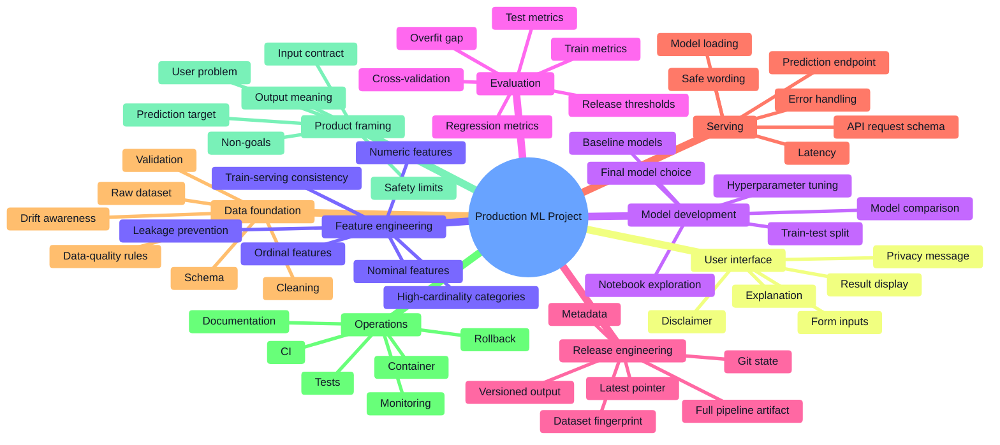
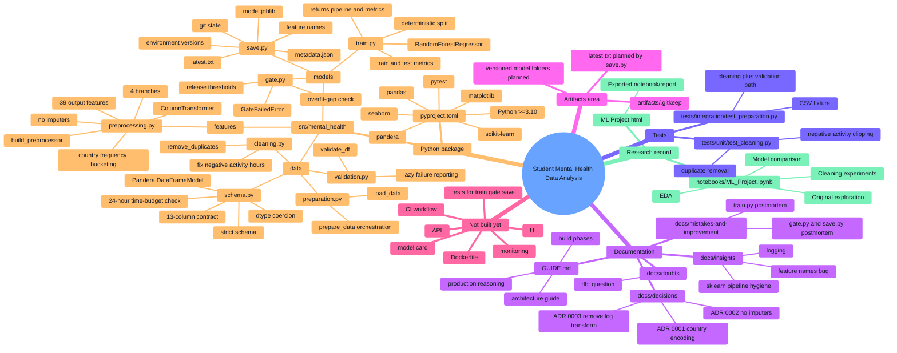
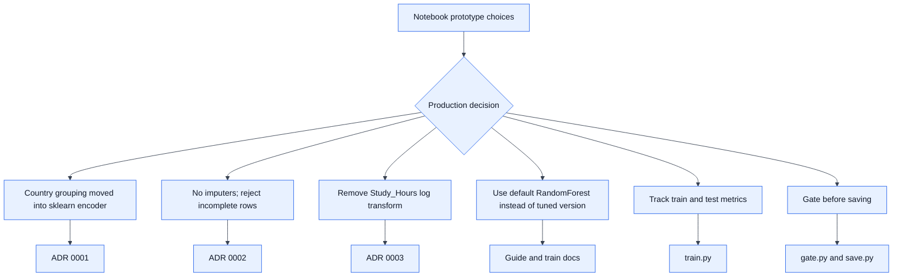
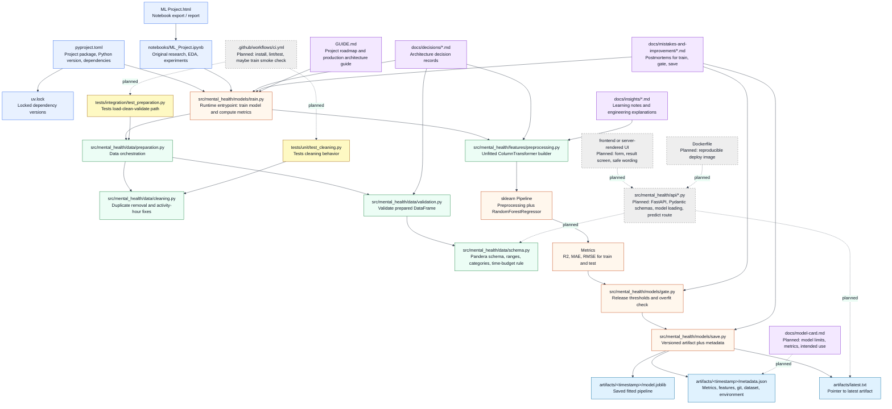
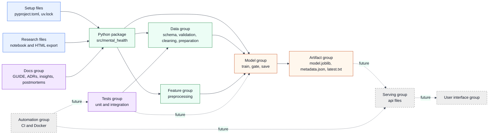
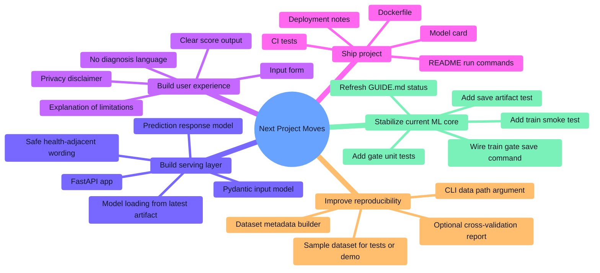

# Project Mind Map

Last reviewed: 2026-08-31

This document maps what has been done so far in two ways:

- Generic ML product terms: the normal path from notebook to production-style ML system.
- Project-specific terms: the exact files, decisions, tests, and gaps in this repository.

## 1. Generic ML Product Mind Map



## 2. This Repository Mind Map



## 3. Current Pipeline Flow

```mermaid
%%{init: {"theme": "base", "themeVariables": {"primaryColor": "#e8f1ff", "primaryTextColor": "#111827", "primaryBorderColor": "#2563eb", "secondaryColor": "#ecfdf5", "secondaryTextColor": "#111827", "secondaryBorderColor": "#15803d", "tertiaryColor": "#fff7ed", "tertiaryTextColor": "#111827", "tertiaryBorderColor": "#c2410c", "lineColor": "#374151", "fontFamily": "Arial, sans-serif"}, "themeCSS": ".nodeLabel, .label, text { fill: #111827 !important; color: #111827 !important; }"}}%%
flowchart LR
  A[Raw CSV in data/raw] --> B[load_data]
  B --> C[remove_duplicates]
  C --> D[fix_physical_activity_hours]
  D --> E[validate_df with Pandera schema]
  E --> F[Split X and y]
  F --> G[train_test_split 70/30 random_state 42]
  G --> H[build_preprocessor]
  H --> I[Pipeline prep plus RandomForestRegressor]
  I --> J[Fit on train only]
  J --> K[Train metrics]
  J --> L[Test metrics]
  K --> M[gate thresholds]
  L --> M
  M --> N[save_artifact]
  N --> O[artifacts/version/model.joblib]
  N --> P[artifacts/version/metadata.json]
  N --> Q[artifacts/latest.txt]

  classDef done fill:#dff7e5,stroke:#218739,color:#0d3518;
  classDef partial fill:#fff4cc,stroke:#b28500,color:#473400;
  classDef planned fill:#eeeeee,stroke:#777,color:#333;

  class A,B,C,D,E,F,G,H,I,J,K,L done;
  class M,N,O,P,Q partial;
```



## 4. What Has Been Done So Far

| Area | Generic meaning | Project-specific implementation | Status |
|---|---|---|---|
| Research notebook | Explore data and model options before productionizing | `notebooks/ML_Project.ipynb` and `ML Project.html` preserve the original analysis path | Done |
| Package setup | Move reusable work out of the notebook | `pyproject.toml`, `src/mental_health/...`, dependencies locked in `uv.lock` | Done |
| Data contract | Define what valid input data means | `SocialMediaUsageSchema` in `src/mental_health/data/schema.py` validates 13 columns, ranges, categories, null policy, and daily time budget | Done |
| Validation entry point | Make schema checks reusable | `validate_df()` logs validation success/failure and raises Pandera errors | Done |
| Cleaning | Fix known data-quality defects before modeling | Duplicate rows are removed; negative `Physical_Activity_Hours` values are clipped to zero | Done |
| Data preparation | Orchestrate loading, cleaning, validation | `prepare_data(path)` reads CSV, cleans it, validates it, returns a usable DataFrame | Done |
| Feature pipeline | Keep training and serving transformations consistent | `build_preprocessor()` returns an unfitted `ColumnTransformer` with numeric, ordinal, nominal, and country branches | Done |
| Leakage prevention | Fit learned transformations only on training data | `train.py` splits before fitting the pipeline | Done |
| High-cardinality encoding | Avoid exploding the country feature and prevent train-serving skew | `OneHotEncoder(handle_unknown="infrequent_if_exist", max_categories=11)` for `Country` | Done |
| Missing-value policy | Decide whether to guess or reject incomplete data | ADR 0002 chooses no imputers; complete input is required | Done for training, still needed in API |
| Model training | Train an approved model reproducibly | `RandomForestRegressor(random_state=42)` inside a full sklearn `Pipeline` | Done |
| Evaluation | Measure both fit quality and generalization | Train/test R2, MAE, RMSE are computed; guide records test R2 0.8902, MAE 0.3258, RMSE 0.4391 | Done |
| Release gate | Block weak or overfit models | `gate.py` has thresholds: R2 > 0.85, MAE < 0.35, RMSE < 0.50, R2 gap < 0.15 | Started |
| Artifact saving | Persist the exact model and metadata | `save.py` writes `model.joblib`, `metadata.json`, and `latest.txt` into timestamped artifact folders | Started |
| Tests | Prove critical behavior with fast checks | 2 unit tests for cleaning and 1 integration test for preparation | Started |
| Decision records | Explain why choices were made | ADRs cover country encoding, no imputers, and removing `Study_Hours` log transform | Done |
| Learning notes | Capture mistakes and reusable lessons | Docs explain logging, sklearn pipeline hygiene, feature names, train.py mistakes, gate/save mistakes | Done |

## 5. Key Decisions Captured



## 6. File-Specific Dependency Map

There are three useful "first files" depending on what question we are asking:

- First project setup file: `pyproject.toml`. It defines the package and dependencies.
- First research file: `notebooks/ML_Project.ipynb`. It is where the ML idea began.
- First production runtime file: `src/mental_health/models/train.py`. It starts the reusable training path.

The diagram below follows the production runtime path first, then shows supporting tests, docs, and planned files.



## 7. File and Folder Responsibility Table

| File or group | Exists now? | Responsibility | Connects to |
|---|---:|---|---|
| `pyproject.toml` | Yes | Defines project metadata, Python requirement, dependencies, build package path | All Python source and tests |
| `uv.lock` | Yes | Freezes dependency versions for reproducible installs | `pyproject.toml` |
| `notebooks/ML_Project.ipynb` | Yes | Research record: EDA, model experiments, original notebook workflow | Informs `src/mental_health/...` production modules |
| `ML Project.html` | Yes | Rendered/exported version of the notebook | Human review/reporting |
| `src/mental_health/data/schema.py` | Yes | Owns the dataset contract: columns, types, valid values, numeric ranges, cross-column sanity check | `validation.py`, future API request validation |
| `src/mental_health/data/validation.py` | Yes | Applies the Pandera schema and logs validation failures | `preparation.py` |
| `src/mental_health/data/cleaning.py` | Yes | Owns deterministic data repairs: duplicate removal and clipping negative activity hours | `preparation.py`, unit tests |
| `src/mental_health/data/preparation.py` | Yes | Loads CSV, applies cleaning, validates final DataFrame | `train.py`, integration tests |
| `src/mental_health/features/preprocessing.py` | Yes | Builds an unfitted sklearn `ColumnTransformer` for numeric, ordinal, nominal, and country features | `train.py`, saved model artifact |
| `src/mental_health/models/train.py` | Yes | Main production training path: prepare data, split, fit pipeline, compute metrics | `preparation.py`, `preprocessing.py`, future release command |
| `src/mental_health/models/gate.py` | Yes | Defines release thresholds and rejects underperforming or overfit models | Future release command, `save.py` metadata |
| `src/mental_health/models/save.py` | Yes | Saves fitted pipeline and metadata into versioned artifact folders | `artifacts/`, future release command |
| `artifacts/` | Yes | Storage area for generated model outputs | `save.py`, future API model loader |
| `tests/unit/test_cleaning.py` | Yes | Verifies small, isolated cleaning behavior | `cleaning.py` |
| `tests/integration/test_preparation.py` | Yes | Verifies the file-load, clean, validate path using a fixture CSV | `preparation.py`, fixture CSV |
| `docs/decisions/` | Yes | ADRs explaining why important production choices were made | Code choices in data/features/models |
| `docs/insights/` | Yes | Concept notes explaining sklearn, logging, feature names, and pipeline hygiene | Human learning and review |
| `docs/mistakes-and-improvement/` | Yes | Postmortems that capture real implementation mistakes and fixes | Future tests and refactors |
| `src/mental_health/api/` | Not yet | Planned FastAPI layer: load artifact, validate request, return prediction safely | `artifacts/latest.txt`, schema bounds, model pipeline |
| `frontend/` or server-rendered UI | Not yet | Planned user interface for entering values and reading an educational estimate | API |
| `.github/workflows/ci.yml` | Not yet | Planned automation to run tests and catch regressions | tests, package install |
| `Dockerfile` | Not yet | Planned reproducible runtime image for deployment | API and artifact loading |
| `docs/model-card.md` | Not yet | Planned model documentation: intended use, limits, metrics, risks | metadata, evaluation docs |

## 8. How File Groups Work Together



## 9. Generic Lessons Learned

| Lesson | Generic meaning | Where it appears here |
|---|---|---|
| Keep stateful transforms inside the model pipeline | Anything learned from data must travel with the fitted artifact | Country handling moved from notebook logic to `OneHotEncoder` inside `ColumnTransformer` |
| Split before fit | Test data must not influence preprocessing state | `train.py` calls `train_test_split` before `pipeline.fit()` |
| Reject invalid health-adjacent inputs early | A confident prediction from guessed data is worse than a clear validation error | ADR 0002 and Pandera validation |
| Delete steps that do not earn their place | Extra transformations add maintenance and failure surface | ADR 0003 removes `log1p` for `Study_Hours` |
| Track both train and test metrics | Test score alone hides overfitting | `train.py` returns both metric groups |
| Gate before saving | Bad models should not reach the artifact directory | `gate.py` and `save.py` postmortem |
| Metadata makes artifacts auditable | A model file alone does not explain how or why it was created | `save.py` stores feature names, metrics, thresholds, git state, dataset info, and environment versions |
| Crashing loudly beats silently lying | Failures should be visible when assumptions break | Pandera strict schema, no `errors="ignore"` for target drop, custom `GateFailedError` |

## 10. Project-Specific Status Snapshot

### Done

- Notebook-to-package transition has started successfully.
- Data validation is explicit and strict.
- Cleaning rules are separated from training.
- Preprocessing is sklearn-native and pipeline-safe.
- Training returns a fitted full pipeline plus JSON-friendly metrics.
- Three important ADRs exist and are tied to actual measurements or risk.
- The release-gate and artifact-saving design now exists in code.
- There are fast tests for cleaning and one preparation integration path.

### Partially Done

- `gate.py` exists, but has no direct tests yet.
- `save.py` exists, but has no direct tests yet.
- Artifact writing exists as a function, but the full train -> gate -> save entry point is not wired as a single release command yet.
- `GUIDE.md` says Phase 2 was not built yet, but the current tree shows `gate.py` and `save.py`; the guide should be refreshed.
- The raw dataset is gitignored, so a fresh clone still needs a sample dataset or documented download/source path.

### Not Built Yet

- FastAPI service.
- Pydantic request/response models.
- Web UI.
- Model card.
- CI workflow.
- Dockerfile/container setup.
- Monitoring/drift checks.
- Cross-validation or repeated-split evaluation.
- Tests for `train.py`, `gate.py`, and `save.py`.

## 11. Next Work Mind Map



## 12. Recommended Immediate Priority

The next clean milestone is not the UI. It is a reliable release command:

```text
prepare data -> train pipeline -> compute metrics -> gate metrics -> save artifact -> write metadata
```

That milestone should include tests for:

- `gate()` passing good metrics.
- `gate()` rejecting underperforming metrics.
- `gate()` rejecting overfit metrics.
- `save_artifact()` creating `model.joblib`, `metadata.json`, and `latest.txt`.
- `train()` running on a small valid fixture without crashing.

Once that is stable, the API can load a known-good artifact instead of training or guessing at startup.
